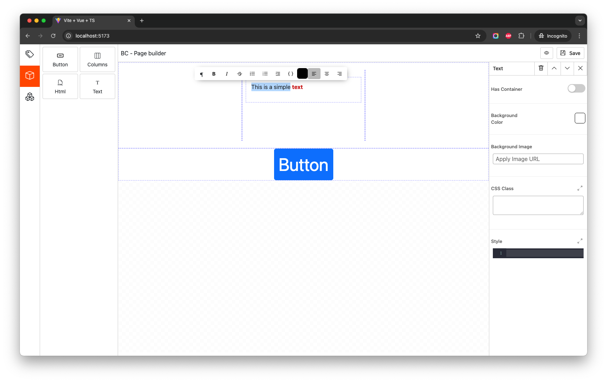

# BinaryCastle Page Builder

This is an extendable page builder based on `vue` `ts` with `vite`



## Installation
Install via npm
```
    npm i @binarycastle/page-builder
```

Install via yarn
```
    yarn add @binarycastle/page-builder
```

## Usages
```
<script setup>
import {PageBuilder} from "@binarycastle/page-builder";

const onSave = (value) => {
  console.log(value)
}
</script>

<template>
    <PageBuilder @onSave="onExport"></PageBuilder>
</template>
```

## Reusable Components
- PageBuilder : page builder is the base accept css-url and event emit onSave
- PagePreview : Page preview is for render page without showing builder outline accept css-url and render-list which is array of Block
- OptionWidget :
- RichTextEditor :
- CodeMirrorEditor :
- BasePreview :
- BaseOption :

## Register new block
```vue
<script setup>
import {PageBuilder, registerBlock} from "@binarycastle/page-builder";

registerBlock({
  type: 'element',
  component: CustomComponent,
  optionComponent: CustomOptionComponent,
  options: {},
  title: 'Custom El',
  name: 'custom_el',
  description: 'as',
  previewImg: '',
  icon: 'pass icon can be svg or html'
})

</script>

<template>
    <PageBuilder @onSave="onExport"></PageBuilder>
</template>
```

### Use of BasePreview on register new block
```vue
<script setup lang="ts">
  import {BasePreview, Block} from "@binarycastle/page-builder"

  interface Props {
    blockInfo: Block;
    inEditor?: boolean
  }

  defineProps<Props>()
</script>

<template>
  <BasePreview :inEditor="inEditor">
    <h1>Hello</h1>
  </BasePreview>
</template>

<style scoped>

</style>
```

### Use of BaseOption on register new block
```vue
<script setup lang="ts">
  import {BaseOption, Block} from "@binarycastle/page-builder"

  interface Props {
    blockInfo: Block;
    inEditor?: boolean
  }

  defineProps<Props>()

</script>

<template>
  <BaseOption title="Custom">

  </BaseOption>
</template>

<style scoped>

</style>
```